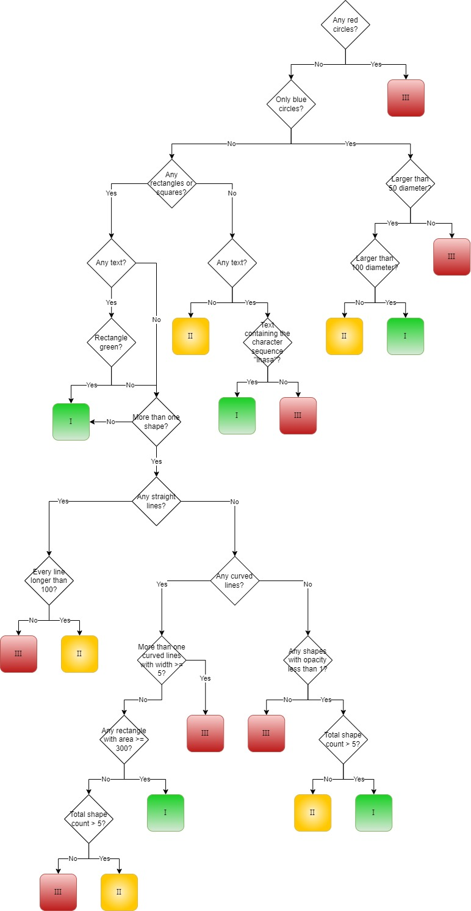

# Scientific Software Kata – Classification workflow
### What we’re going to build
This exercise is based roughly on a decision tree workflow for categorising the risk of a chemical to human safety – known as the [Cramer classification](https://doi.org/10.1016/S0015-6264(76)80522-6).

First published in the 1970s and tweaked a few times since then, the Cramer classification is a series of yes/no questions and is used as a rough guide to how dangerous a chemical is to humans if we eat them. The output of the workflow gives a category for every compound corresponding to how likely they are to be toxic - 1 for low risk, 2 moderate, or 3 high risk.

All chemicals are made up of atoms or groups of atoms, which we call “functional groups”, and it is the presence, type, combination, and arrangement of atoms that ultimately results in the risk to humans and animals.

We can approximate the chemicals and their attributes to a collection of shapes and objects (atoms) grouped together (functional groups) within a file (chemical). We can then analyse these files and run them through a classification workflow just like the Cramer classification, inspecting different attributes to ultimately get a category for each file.

As you will see, **zero** chemistry or biology knowledge is required to complete this exercise! Hopefully by the end you’ll feel more confident to trying to tackle programming problems within the life sciences domain!

### What you'll need
You’ll need the following (included in this repo):
*	The workflow image
*	The example data files
*	The test data files
*	(Optional) A library for simplifying the parsing of SVG files in your preferred language

The workflow image describes the logic and decisions that need to be made along the way.

Each file approximates a chemical compound, and so by following the workflow we can assign a category of 1, 2 or 3 to each file. The files we will be using are SVG images, each containing a mixture of objects with varying properties.

The resulting categories in our workflow match the ones for the real classification, plus a fourth of "can't classify" to help with the exercise:

> 1 = Low risk
> 
> 2 = Moderate risk
> 
> 3 = High risk
> 
> -1 = Can't classify

Each example file is a simple example for each of the paths and has an expected category. The test data files are for checking your code “in the wild” with more complex objects.

For simplicity, the colours used to start with will be named, as will shapes.

The workflow looks like this:



### Getting started
The first decision point has a simple check, so we can tackle this part first. This will also allow us to get the setup ready for extending.

The first decision point asks if there are “any red circles”.
*	If yes, assign a category of 3 and exit the workflow.
*	If no, continue.

To be able to answer this question, we need to:
a)	Pass in your input file/folder to your code
b)	Read the contents of your input file
c)	Check for any red circles

Part A is a common task required in software development, and there will be plenty of help for this available online if required.

There are a few options you could take for part B – either reading the file manually to parse the components present or using a library to read the file for you. To allow you to focus on the logic of the workflow rather than file reading, I would recommend using a library if possible. Some good libraries would be:
*	For Python, [Beautiful Soup](https://pypi.org/project/beautifulsoup4/) or [svgelements](https://pypi.org/project/svgelements/)
*	For JavaScript, [svg-parser](https://www.npmjs.com/package/svg-parser)
*	For Java, [svgSalamander](https://central.sonatype.com/artifact/guru.nidi.com.kitfox/svgSalamander)

Once your code can read in the files, now you’re ready for part C – the first part of the workflow!

### The First Decision in the Tree
The first example file you have contains the following information:

```
<svg xmlns="http://www.w3.org/2000/svg" width="200" height="200">
	<circle cx="100" cy="100" r="80" fill="red" />
</svg>
```
and looks like this:


As you can see, there’s one red circle, which should therefore exit our workflow after the first question.

#### Simple Java implementation example
If you're using the svgSalamander library, you can write a simple method to check for this condition once you have the list of objects contained within the SVG input file:

```
private static boolean anyRedCircles(List<SVGElement> objects) {
	for (SVGElement o : objects) {
		if (o instanceof Circle && Color.RED.equals(o.getPresAbsolute("fill").getColorValue())) {
			return true;
		}
	}
	return false;
}
```

This method can then be hooked into a parent method to get your category from your file, returning 3 if there are any red circles present, and our value for “can’t classify” of -1 if not:
```
public int getCategory(Path file) {
	List<SVGElement> fileObjects = readSVGFile(file);
	if (anyRedCircles(fileObjects)) {
		return 3;
	}
	return -1;
}
```

### Output
We want to you to copy the input files into the appropriate output directories depending on the category assigned to them.
Directory pattern is shown below; also seen in the test-data folder. Put this anywhere on the filesystem but the default is
> C:/kata-svg
* Input
	* All files start in here, copy them into the relevant output folders:
* Output
	* Cat1
	* Cat2
	* Cat3
	* Unclassified

### Testing your implementation
We are providing an executable jar that will test the outcome of your implementation.
Run with Java 17, if you do not have Java then we can copy your output somewhere that does.
In order to use it, you need to run your implementation to copy the files from input director to output directories.
Once done, if you are using the default location of 'C:/kata-svg' you can run the jar:
> java -jar svg-1.0-SNAPSHOT.jar
> 
If you are using a custom location for the folder structure, pass the absolute path to the root directory as the first argument to the jar:
> java -jar svg-1.0-SNAPSHOT.jar "C:/myLocation/else where"
> 
#### JUnit
For those programming in Java, the tests can be run by JUnit through your IDE as well as via the executable jar. 
